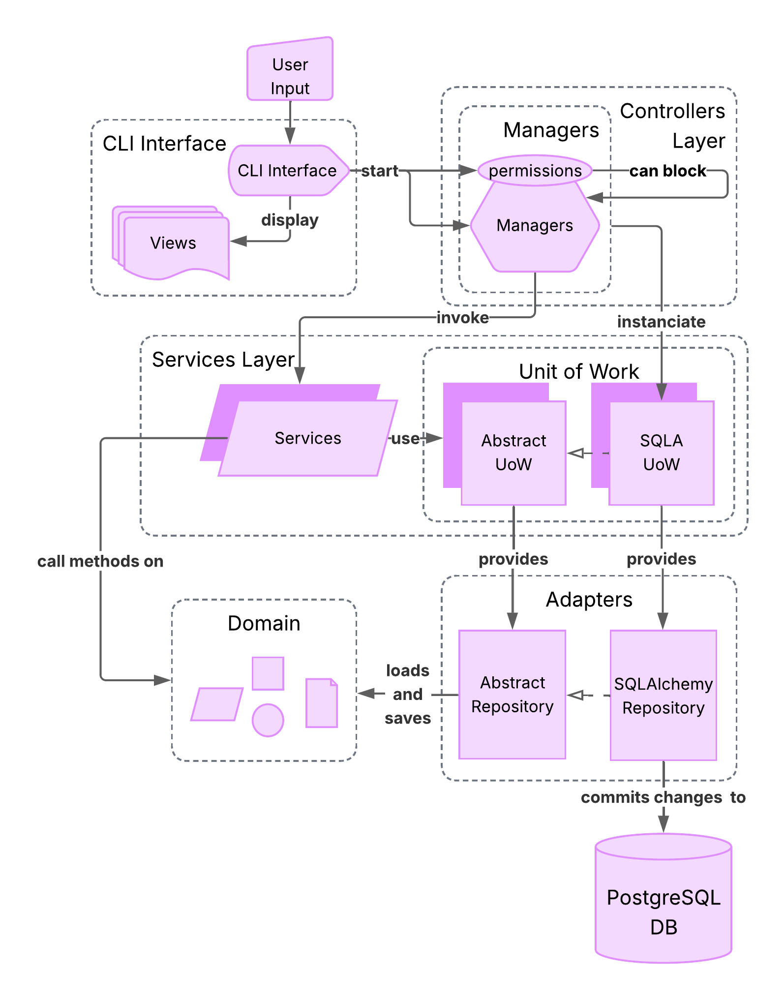

# Epic Events CRM CLI - Project 12

twelfth project for the online course of python application development on 
OpenClassrooms.

<p align="center">
    
</p>

## Description

Epic Events CRM is a Command Line Interface (CLI) created for an imaginary company "Epic Events". 
The application allows its users to communicate with a locally deployed 
database. It is configured to work with PostgreSQL but may be easily altered 
to accept any kinds of data storing systems.

## Features
* Secure authentication with JWT.
* Manage collaborators, clients, contracts and events with a single line of command.
* Strict permissions enforced by the combination of a Role Based Access Control (RBAC) and an Attribute Based Access Control (ABAC).
* Command Line Interface (CLI) implemented with Click.
* Local and Online (Sentry) logging available.

For a quick reference of available commands, see [DOC.md](DOC.md)

## Architecture
```
src/ee_crm/
├─ config.py                    # Environment variables & configuration
├─ exceptions.py                # Custom exceptions
├─ loggers.py                   # Loggers
├─ __main__.py                  # Entrypoint
│
├─ adapters                     # Handle database transactions
│  ├─ orm.py
│  └─ repositories.py
│
├─ cli_interface                # Click implementation of views
│  ├─ authentication.py
│  ├─ commands.py
│  ├─ utils.py
│  ├─ app                       # Click commands
│  │  ├─ client.py
│  │  ├─ cli_func.py
│  │  ├─ collaborator.py
│  │  ├─ contract.py
│  │  ├─ event.py
│  │  └─ user.py
│  └─ views                     # Click output
│     ├─ view_base.py
│     ├─ view_base_crud.py
│     ├─ view_client.py
│     ├─ view_collaborator.py
│     ├─ view_contract.py
│     ├─ view_errors.py
│     ├─ view_event.py
│     └─ view_user.py
│
├─ controllers                  # Start service, send back DTO
│  ├─ default_uow.py
│  ├─ utils.py
│  ├─ app                       # Resource controllers
│  │  ├─ base.py
│  │  ├─ client.py
│  │  ├─ collaborator.py
│  │  ├─ contract.py
│  │  ├─ event.py
│  │  └─ user.py
│  └─ auth                      # Permission
│     ├─ authentication.py
│     ├─ permission.py
│     ├─ predicate.py
│     └─ rbac.py
│
├─ domain                       # Domain model
│  ├─ model.py
│  └─ validators.py
│
└─ services                     # Business logic
   ├─ dto.py
   ├─ unit_of_work.py
   ├─ app                       # Resource services
   │  ├─ base.py
   │  ├─ clients.py
   │  ├─ collaborators.py
   │  ├─ contracts.py
   │  ├─ events.py
   │  └─ users.py
   └─ auth                      # Auth logic
      ├─ authentication.py
      ├─ jwt_handler.py
      └─ permissions.py
```

## Project Design
This project applies the Domain Driven Development principles, 
to improve modularity and maintainability. It uses the ideas from 
[Architecture Patterns with Python](https://www.cosmicpython.com/book/preface.html) 
by Harry Percival and Bob Gregory.

<p align="center">
    
</p>

## Database schema
<p align="center">
    
</p>

## Installation

### Clone the project and activate the virtual environment

```bash
git clone https://github.com/a-beduc/formation_project_12.git
cd formation_project_12/

python -m venv .venv

source .venv/bin/activate  # Linux
.venv\Scripts\activate     # Windows
```

### Install dependencies

You can install dependencies with pip or uv.

<details>
<summary>With uv (recommended)</summary>

+ Install dependencies:

    ```bash
    uv sync         # Only needed dependencies
    
    uv sync --dev   # Additional dev tools (tests, linter)
    ```
+ Build the package:

    ```bash
    uv build
    ```
</details>

<details>
<summary>With Pip</summary>

+ Install dependencies

   ```bash
   pip install -e .         # Only needed dependencies
   or 
   pip install -e .
   pip install pytest pytest-cov ruff
   ```
  
+ Build package
   ```bash
   pip install -r requirements.txt
   ```
</details>

### Create a postgreSQL database
+ download PostgreSQL [link](https://www.postgresql.org/download/)
+ install PostgreSQL [tutorial](https://www.w3schools.com/postgresql/postgresql_install.php)
+ open ``psql``
+ connect to your chosen server
<p align="center">
    
</p>

+ create a new user

    ```psql
    CREATE ROLE eecrm WITH LOGIN PASSWORD '<your_password>';
    ```


+ create a new database

    ```psql
    CREATE DATABASE eecrm
    WITH OWNER eecrm;
    ```
  
+ connect to the new database as eecrm

    ```psql
    \c eecrm eecrm
    ```
  
+ Create schema and insert using `.sql`

    ```psql
    \i 'Path/to/project/db_reset/create.sql'
    \i 'Path/to/project/db_reset/insert.sql'
    ```
  
+ Verify that the database is properly seeded

    ```psql
    SELECT * FROM crm.collaborator;
    ```

### Configure Sentry

The project uses [Sentry](https://sentry.io/) for error tracking.
+ If you have not already created an account, go to: [Getting started with sentry](https://sentry.io/signup/).
+ Create a new python project and follow the instruction.
+ Copy the provided DSN.
+ You can find the DSN in your Sentry project settings under 
**Project > Client Key**.

### Configure environment variables

At the root of the project, copy the content of the ``.env.example`` file in a
``.env`` file. If you have chosen different values for the postgreSQL database
configuration adapt the variables. At minimum, you must provide the proper 
settings for the following parameters.

+ POSTGRESQL SETTINGS
  + PG_PASSWORD: The password you have chosen for the user 'eecrm'
+ JWT SECRET
  + SECRET_KEY: The secret key used for the tokens encryption. [secret key generator](https://djecrety.ir/)
+ SENTRY SETTING
  + SENTRY_DSN: The DSN provided by sentry to receive logs.

### Launch the application

* Open a console.
* Navigate to the project root.
* Activate the virtual environment.
* Try `eecrm --help`

To try more commands, please refer to [documentation](DOC.md)

## Tests

The tests are found in the ``tests/`` directory. Most tests are unit tests. 
To execute tests:
+ Install the ee_crm package.
+ Navigate to the root of the project.
+ Activate the virtual env. [link to install](#installation)
+ `pytest --cov --cov-report=term-missing`

```
tests/
├─ conftest.py                  # fixtures
├─ test_adapters                # adapters layer tests               
│  ├─ test_orm.py
│  ├─ test_repositories.py
│  └─ integration
│     └─ test_orm.py
├─ test_cli_interface           # click interface tests
│  ├─ test_authentication.py
│  ├─ test_cli_func.py
│  ├─ test_user.py
│  ├─ test_utils.py
│  ├─ test_view_crud_base.py
│  └─ test_view_errors.py
├─ test_controller              # managers and permissions tests
│  ├─ test_collaborator.py
│  ├─ test_permission.py
│  ├─ test_utils.py
│  └─ test_integration          # cover most paths
│     ├─ test_authentication.py
│     ├─ test_client.py
│     ├─ test_collaborator.py
│     ├─ test_contract.py
│     ├─ test_event.py
│     ├─ test_predicate.py
│     └─ test_user.py
├─ test_domain                  # domain test
│  ├─ test_model.py
│  └─ test_validators.py
└─ test_service                 # service test
   ├─ test_authentication.py
   ├─ test_clients.py
   ├─ test_collaborators.py
   ├─ test_contracts.py
   ├─ test_events.py
   ├─ test_jwt_handler.py
   ├─ test_permissions.py
   ├─ test_users.py
   └─ integration
      └─ test_uow.py
```

## Configuration

### Role Based Access Control
Role based permissions are located in the file [rbac.py](src/ee_crm/controllers/auth/rbac.py).

### Loggings
Exception are logged in the ``.logs/`` directory created when an Exception occurs. They are logged in an ERRORS file and sent to Sentry.
Some transaction are also logged in the ``.logs/`` director under the ACID files.

Whenever a log is created, it also sent the exception or message to Sentry.

### Documentation
A detailed documentation : [DOC.md](DOC.md)

